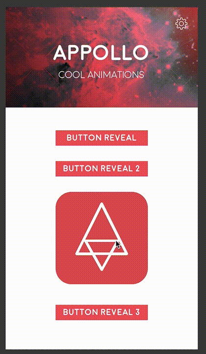
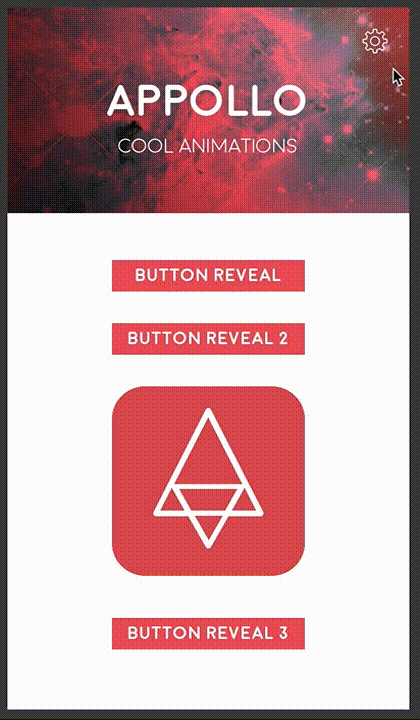

# Animated transitions for Xamarin.iOS 

You can find a lot of animated transitions for iOS on the web, but most of them are written either in Objective-C or Swift. This library contains a small amount of cool transitions, ported to C# for Xamarin.iOS.

There is some sample code available, currenyly the MvvmCross 5 sample "Cool Animations" is up-to-date. I am working hard to bring more samples and more transitions into this library.


## Usage
- TODO: With Xamarin.iOS
- With [MvvmCross](#MvvmCross)

## Transitions

### ImageRevealTransition



### CircleButtonRevealTransition



## <a name="MvvmCross"></a>Using transitions with MvvmCross

Add the nuget package "Redhotminute.Plugin.iOS.AnimatedTransitions" to your iOS project. 

Create start and a target MxvViewController, create bindings, viewmodels, etc, make sure the navigation between the ViewControllers work.

For all transitions:

1. The starting ViewController should be of type IStartAnimationViewController.

```C#
public partial class HomeViewController : MvxViewController<HomeViewModel>, IStartAnimationViewController
{
	...
```

2. The target ViewController should look like this:

```C#
[MvxModalPresentation(ModalPresentationStyle = UIModalPresentationStyle.FullScreen,
                          ModalTransitionStyle = UIModalTransitionStyle.CrossDissolve)]
public partial class SettingsViewController : MvvmCross.iOS.Views.MvxViewController<SettingsViewModel>
{
	public override void ViewDidLoad()
	{
		base.ViewDidLoad();

		TransitioningDelegate = new CircleButtonRevealTransitioningDelegate(0.4f, UIColor.White);
```

3. Set the StartFrame (and StartImage if needed) in the starting viewcontroller

```C#
SettingsButton.TouchUpInside += async (sender, e) =>
{
	StartFrame = AnimationHelper.GetFrameFromViewInScrollView(ScrollView, SettingsButton.Frame);
	await ViewModel.SettingsCommand.ExecuteAsync().ConfigureAwait(false);
};
```

## TODO
- Add more transitions
- Dive into interactive transitions
- Add multiple parameters (open vs close duration), open vs close alpha

## Inspiration, Docs, Links

* http://mathewsanders.com/custom-menu-transitions-in-swift/
* https://www.raywenderlich.com/86521/how-to-make-a-view-controller-transition-animation-like-in-the-ping-app
* https://www.raywenderlich.com/146692/ios-animation-tutorial-custom-view-controller-presentation-transitions-2
* https://www.raywenderlich.com/110536/custom-uiviewcontroller-transitions
* https://github.com/andreamazz/BubbleTransition
* https://github.com/onmyway133/fantastic-ios-animation/blob/master/Animation/transition.md
* https://github.com/ameizi/awesome-ios-animation
* https://github.com/recruit-mp/RMPZoomTransitionAnimator/blob/master/Pod/Classes/RMPZoomTransitionAnimator.m
* https://medium.com/@samstone/create-custom-uinavigationcontroller-transitions-in-ios-1acd6a0b6d25

## License

Redhotminute.Plugin.iOS.AnimatedTransitions is licensed under the [MIT License](LICENSE)